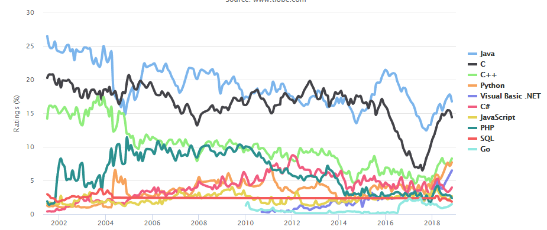

---
presentation:
  width: 800
  height: 600
  theme: "sky.css"
  center: true
---

<!-- slide -->
## python介绍

### 2018/11/24

<!-- slide -->
### 1. Python是一种什么语言？
### 1.1 编程语言如何让机器干活 
首先，我们普及一下编程语言的基础知识。用任何编程语言来开发程序，都是为了让计算机干活，比如:下载一个MP3、编写一个文档等等……

而计算机干活的CPU只认识机器指令，所以，尽管不同的编程语言差异极大，最后都得“翻译”成CPU可以执行的机器指令。而不同的编程语言，干同一个活，编写的代码量，差距也很大。

<!-- slide -->

### 1.2 python和其他语言比较
比如，完成同一个任务，C语言要写1000行代码，Java只需要写100行，而Python可能只要20行。

所以Python是一种相当高级的语言。

你也许会问，代码少还不好？代码少的代价是运行速度慢，C程序运行1秒钟，Java程序可能需要2秒，而Python程序可能就需要10秒。

<!-- slide -->
### 1.3 python学习难易度
那是不是越低级的程序越难学，越高级的程序越简单？表面上来说，是的，但是，在非常高的抽象计算中，高级的Python程序设计也是非常难学的，所以，高级程序语言不等于简单。

但是，对于初学者和完成普通任务，Python语言是非常简单易用的。连Google都在大规模使用Python，你就不用担心学了会没用。

<!-- slide -->
### 1.4 python能/不能做什么
用Python可以做什么？可以做日常任务，比如自动备份你的MP3；可以做网站，很多著名的网站包括YouTube就是Python写的；可以做网络游戏的后台，很多在线游戏的后台都是Python开发的。总之就是能干很多很多事啦。
Python当然也有不能干的事情，比如写操作系统，这个只能用C语言写；写手机应用，只能用Swift/Objective-C（针对iPhone）和Java（针对Android）；写3D游戏，最好用C或C++。

<!-- slide -->
### 2. Python介绍
### 2.1 Python的起源和对比
Python是著名的“龟叔”Guido van Rossum在1989年圣诞节期间，为了打发无聊的圣诞节而编写的一个编程语言。

现在，全世界差不多有600多种编程语言，但流行的编程语言也就那么20来种。如果你听说过TIOBE排行榜，你就能知道编程语言的大致流行程度。

<!-- slide -->
这是最近10年最常用的10种编程语言的变化图：

<!-- slide -->
总的来说，这几种编程语言各有千秋。
- C语言是可以用来编写操作系统的贴近硬件的语言，所以，C语言适合开发那些追求运行速度、充分发挥硬件性能的程序
- 而Python是用来编写应用程序的高级编程语言

<!-- slide -->
### 2.2 如何选择编程语言
当你用一种语言开始作真正的软件开发时，你除了编写代码外，还需要很多基本的已经写好的现成的东西，来帮助你加快开发进度。比如说，要编写一个电子邮件客户端，如果先从最底层开始编写网络协议相关的代码，那估计一年半载也开发不出来。高级编程语言通常都会提供一个比较完善的基础代码库，让你能直接调用，比如，针对桌面环境的GUI库等

<!-- slide -->
Python就为我们提供了非常完善的基础代码库，覆盖了网络、文件、GUI、数据库、文本等大量内容，被形象地称作“内置电池（batteries included）”。用Python开发，许多功能不必从零编写，直接使用现成的即可。
除了内置的库外，Python还有大量的第三方库，也就是别人开发的，供你直接使用的东西。当然，如果你开发的代码通过很好的封装，也可以作为第三方库给别人使用。

<!-- slide -->
最后说说Python的缺点。

任何编程语言都有缺点，Python也不例外。优点说过了，那Python有哪些缺点呢？

第一个缺点就是运行速度慢，和C程序相比非常慢，因为Python是解释型语言，你的代码在执行时会一行一行地翻译成CPU能理解的机器码，这个翻译过程非常耗时，所以很慢。而C程序是运行前直接编译成CPU能执行的机器码，所以非常快。

<!-- slide -->
但是大量的应用程序不需要这么快的运行速度，因为用户根本感觉不出来。例如开发一个下载MP3的网络应用程序，C程序的运行时间需要0.001秒，而Python程序的运行时间需要0.1秒，慢了100倍

<!-- slide -->
但由于网络更慢，需要等待1秒，你想，用户能感觉到1.001秒和1.1秒的区别吗？这就好比F1赛车和普通的出租车在北京三环路上行驶的道理一样，虽然F1赛车理论时速高达400公里，但由于三环路堵车的时速只有20公里，因此，作为乘客，你感觉的时速永远是20公里。

<!-- slide -->
第二个缺点就是代码不能加密。如果要发布你的Python程序，实际上就是发布源代码，这一点跟C语言不同，C语言不用发布源代码，只需要把编译后的机器码（也就是你在Windows上常见的xxx.exe文件）发布出去。要从机器码反推出C代码是不可能的，所以，凡是编译型的语言，都没有这个问题，而解释型的语言，则必须把源码发布出去。

<!-- slide -->
这个缺点仅限于你要编写的软件需要卖给别人挣钱的时候。好消息是目前的互联网时代，靠卖软件授权的商业模式越来越少了，靠网站和移动应用卖服务的模式越来越多了，后一种模式不需要把源码给别人。
